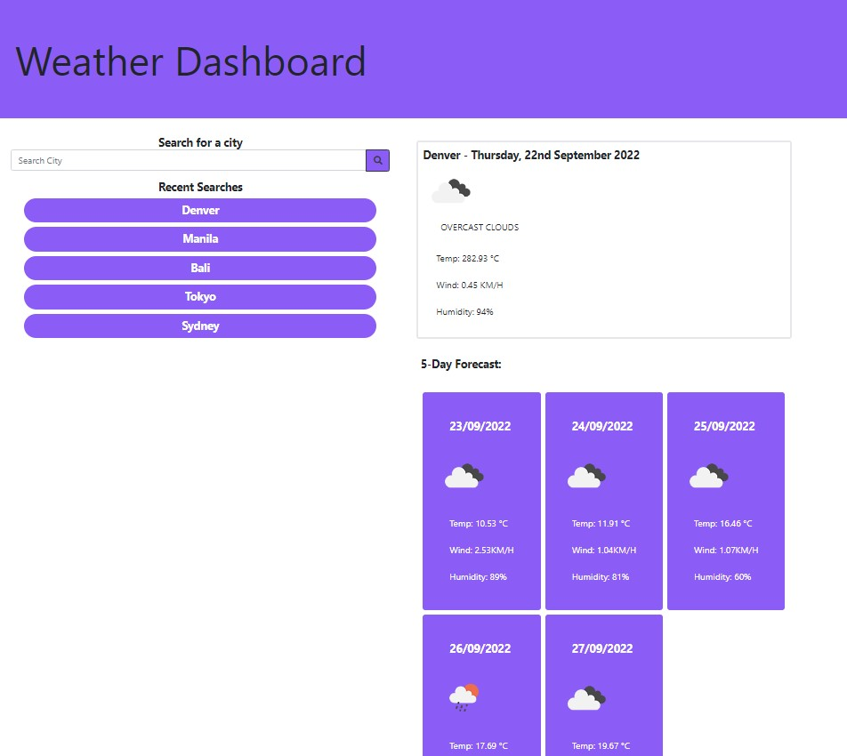
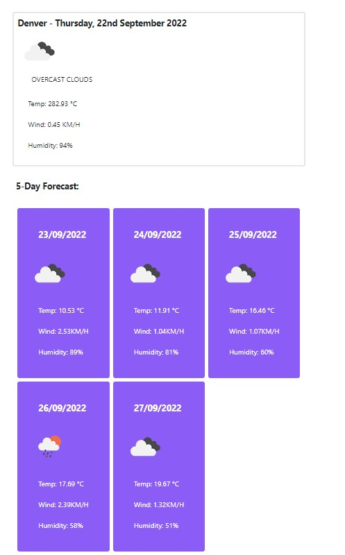

# Changeling006
```Changeling - A word of play for 'Challenging'```

```006 - Natural number following 005 (The previous challenge in this course)```

## Links to Repo and deployment📌

🔸 GitHub Repository [link](https://github.com/Changeling006)

🔸 Site is live [HERE](https://jmdg1023.github.io/Changeling006)


## User Story 👨

```http
AS A traveler
I WANT to see the weather outlook for multiple cities
SO THAT I can plan a trip accordingly
```


## What this project does 💡💡💡

```http
1. WHEN user search for a city
 THEN I will be presented with current and future conditions for that city and that city is added to the search history.

2. WHEN viewing current weather conditions for that city
THEN I am presented with the city name, the date, an icon representation of weather conditions, the temperature, the humidity, the wind speed, and the UV index.

3. WHEN I view the UV index
THEN I am presented with a color that indicates whether the conditions are favorable, moderate, or severe

4. WHEN I view future weather conditions for that city
THEN I am presented with a 5-day forecast that displays the date, an icon representation of weather conditions, the temperature, the wind speed, and the humidity

5. WHEN I click on a city in the search history
THEN I am again presented with current and future conditions for that city
```


# Screenshots

## Weather Dashboard



## Current and five day forecast



## Recent Search Bar


## Learning Resources 🔗

🔸 [Previous Project search bar](https://github.com/jmdg1023/Project-Crescendo)

🔸 [Tailwind](https://tailwindcss.com/)

🔸 [Build a Weather App with HTML, CSS & JavaScript on YouTube](https://www.youtube.com/watch?v=WZNG8UomjSI&t=1505s)


## License 📜

[](https://github.com/mecuboi/my-profile-website/blob/main/LICENSE)